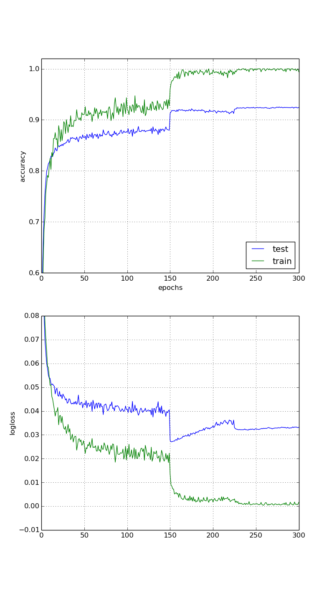

This is a sample implementation of DenseNet-40 applied to CIFAR-10, see the [Densely Connected Convolutional Network](http://arxiv.org/abs/1608.06993) paper for details. The original paper implementation using Torch can be found on [github](https://github.com/liuzhuang13/DenseNet).

This uses the python version of the [CIFAR-10 dataset](https://www.cs.toronto.edu/~kriz/cifar.html). Most implementation details should be similar to the reference paper/implementation.

* The SGD optimizer is used with a momentum of 0.9. The initial learning rate is 0.1, it gets divided by 10 at epochs 150 and 225.
* Weight decay is set to 1e-4.
* Batch size is 64.
* This implements DenseNet-40, i.e. 3 dense blocks of 12 layers each. The growth rate is set to 12.
* A dropout with a keep probability of 0.8 is used after each convolution. Convolutions don't use any bias.

The resulting accuracy is 93% on CIFAR-10 without data augmentation which is similar to what is reported in the paper.

