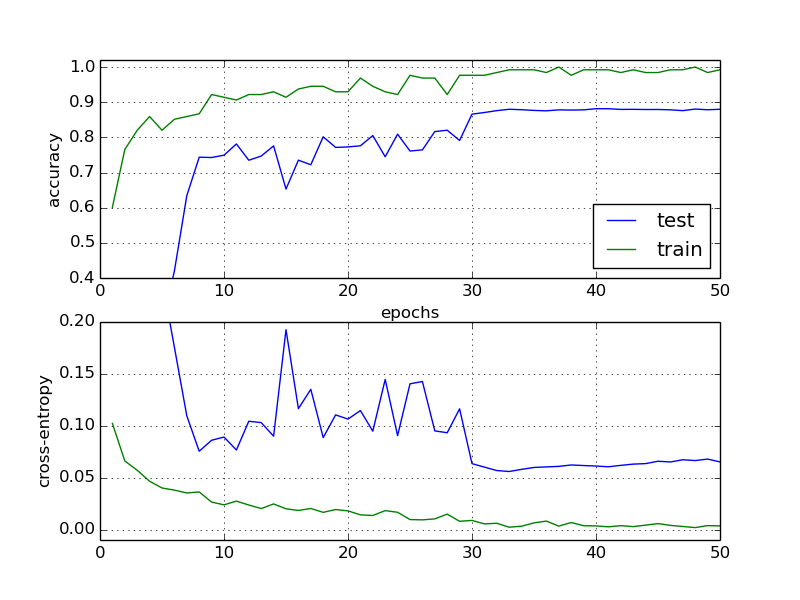

This is a sample implementation of a Deep Residual Network (ResNet) as introduced in [Deep Residual Learning for Image Recognition](https://arxiv.org/abs/1512.03385). The original implementation using caffe can be found on [github](https://github.com/KaimingHe/deep-residual-networks).

This uses the python version of the [CIFAR-10 dataset](https://www.cs.toronto.edu/~kriz/cifar.html). Some of the implementation details have been inspired by
the DenseNet implementation and this [blog post](http://torch.ch/blog/2016/02/04/resnets.html).

* Implement the ResNet-110 variant.
* There is no ReLU at the end of residual blocks.
* The SGD optimizer is used with a momentum of 0.9. The initial learning rate is 0.1, it gets divided by 10 at epochs 30.
* Batch size is 128.
* A dropout with a keep probability of 0.8 is used after each convolution. Convolutions don't use any bias.

The resulting accuracy is 88.2% on CIFAR-10 without data augmentation. 

